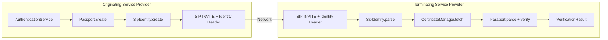
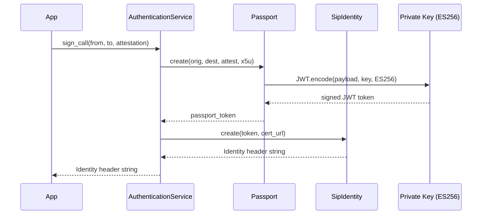
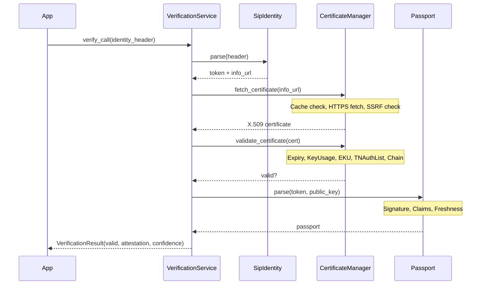
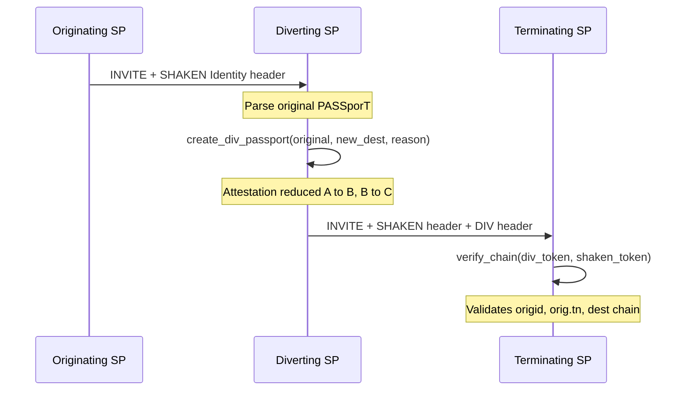
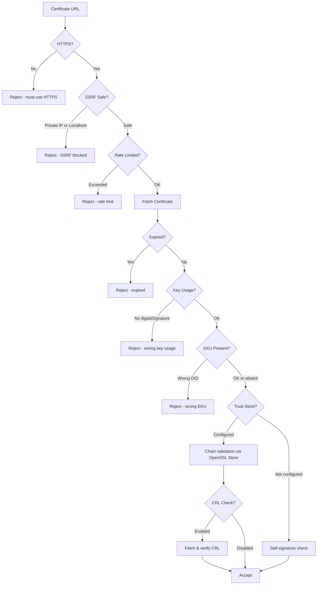

# STIR/SHAKEN Ruby

A complete Ruby implementation of the STIR/SHAKEN protocol suite for caller ID authentication in telecommunications, covering RFC 8224, 8225, 8226, 8588, and 8946.

## What It Does

STIR/SHAKEN combats caller ID spoofing by cryptographically signing and verifying call identity. This gem provides:

- **Sign outbound calls** with ES256-signed PASSporT tokens
- **Verify inbound calls** by validating signatures against certificates
- **Handle call diversion** with DIV PASSporT tokens (RFC 8946)
- **Manage certificates** with caching, chain validation, CRL checking, and SSRF protection
- **Full RFC compliance** including TNAuthList, Extended Key Usage, and lexicographic claim ordering

## Architecture



## Call Signing Flow



## Call Verification Flow



## Call Diversion Flow (RFC 8946)



## Certificate Validation Pipeline



## Quick Start

```ruby
require 'stirshaken'

# 1. Generate keys (test only — use real STI certs in production)
key_pair = StirShaken::AuthenticationService.generate_key_pair
private_key = key_pair[:private_key]
public_key  = key_pair[:public_key]

certificate = StirShaken::AuthenticationService.create_test_certificate(
  private_key, telephone_numbers: ['+15551234567']
)

# 2. Sign a call
auth_service = StirShaken::AuthenticationService.new(
  private_key: private_key,
  certificate_url: 'https://cert.example.com/stir.pem',
  certificate: certificate
)

identity_header = auth_service.sign_call(
  originating_number: '+15551234567',
  destination_number: '+15559876543',
  attestation: 'A'
)

# 3. Verify a call
verification_service = StirShaken::VerificationService.new
result = verification_service.verify_call(identity_header)

result.valid?           # => true
result.attestation      # => "A"
result.confidence_level # => 100
```

## Installation

Add to your Gemfile:

```ruby
gem 'stirshaken'
```

```bash
bundle install
```

**Requirements:** Ruby >= 3.4.0, OpenSSL 3.0+

## Attestation Levels

| Level | Name | Confidence | Meaning |
|-------|------|-----------|---------|
| **A** | Full | 100% | SP authenticated the caller and verified number authorization |
| **B** | Partial | 75% | SP authenticated call origination but cannot verify number authorization |
| **C** | Gateway | 50% | SP authenticated the gateway but cannot authenticate the call source |

## Configuration

```ruby
StirShaken.configure do |config|
  # Core settings
  config.certificate_cache_ttl = 3600    # 1 hour (min: 300, max: 86400)
  config.http_timeout = 30               # seconds (min: 5, max: 120)
  config.default_attestation = 'C'       # A, B, or C
  config.default_max_age = 60            # seconds (min: 1, max: 900)

  # Trust store (production)
  config.trust_store_path = '/etc/ssl/stir-shaken'
  config.trust_store_certificates = [ca_pem_string]

  # Revocation checking
  config.check_revocation = true
  config.crl_cache_ttl = 3600
end
```

## Features

### Signing & Verification
- PASSporT token creation/validation with ES256 (P-256)
- SIP Identity header generation/parsing (RFC 8224)
- Multiple Identity header support (`parse_multiple`, `verify_multiple`)
- Destination URIs (`dest.uri`) alongside telephone numbers (`dest.tn`)
- Lexicographic claim ordering per RFC 8588
- `canon` parameter support for SIP canonicalization
- Configurable token freshness window with clock skew tolerance

### Call Diversion (RFC 8946)
- DIV PASSporT creation from PASSporTs or Identity headers
- All 10 diversion reasons: `forwarding`, `deflection`, `follow-me`, `time-of-day`, `user-busy`, `no-answer`, `unavailable`, `unconditional`, `away`, `unknown`
- Chain verification (`verify_chain`) validates origid, orig.tn, and dest consistency
- Automatic attestation reduction (A->B, B->C, C->C)
- Complete call forwarding workflow (`create_call_forwarding`)

### Certificate Management
- Automatic fetching with thread-safe caching
- Full chain validation via configurable trust store
- TNAuthList extension parsing (OID 1.3.6.1.5.5.7.1.26)
- Extended Key Usage validation (id-kp-jwt-stir-shaken)
- CRL distribution point extraction and cached CRL fetching
- Multi-PEM certificate chain parsing
- Certificate pinning with SHA-256

### Security
- HTTPS-only certificate URLs (RFC 8226 section 9)
- SSRF protection (rejects 10/8, 172.16/12, 192.168/16, 127/8, 169.254/16, ::1, fc00::/7, fe80::/10)
- SIP header injection protection (rejects `;`, `\r`, `\n`, `\0`)
- JWT `alg:none` attack prevention (multi-layer ES256 enforcement)
- Constant-time certificate pin comparison
- Fail-secure certificate chain verification
- Rate limiting (10 requests/minute/URL)
- Thread-safe operations (mutex-protected caches and stats)
- Security event audit logging with PII masking

## Error Handling

All errors inherit from `StirShaken::Error`:

```
StirShaken::Error
├── PassportValidationError
├── CertificateError
│   ├── CertificateFetchError
│   ├── CertificateValidationError
│   └── CertificateRevocationError
├── SignatureVerificationError
├── InvalidAttestationError
├── InvalidPhoneNumberError
├── InvalidIdentityHeaderError
├── InvalidTokenError
├── ConfigurationError
└── InvalidDiversionReasonError
```

```ruby
result = verification_service.verify_call(identity_header)

if result.valid?
  puts "Verified: #{result.attestation} (#{result.confidence_level}%)"
else
  puts "Failed: #{result.reason}"
end
```

## RFC Compliance

| RFC | Title | Coverage |
|-----|-------|----------|
| **8224** | Authenticated Identity Management in SIP | Identity header create/parse, `canon` param, multiple headers |
| **8225** | PASSporT | Token create/parse/validate, `dest.tn` + `dest.uri`, lexicographic ordering |
| **8226** | Secure Telephone Identity Credentials | HTTPS enforcement, TNAuthList, EKU, trust store chain validation, CRL |
| **8588** | SHAKEN | Attestation A/B/C, `ppt=shaken`, freshness, `origid`, configurable `max_age` |
| **8946** | DIV PASSporT | `ppt=div`, all 10 diversion reasons, chain verification, attestation reduction |

See [docs/rfc-compliance.md](docs/rfc-compliance.md) for the detailed compliance matrix.

## Documentation

| Guide | Description |
|-------|-------------|
| [Getting Started](docs/getting-started.md) | Installation, prerequisites, quick start walkthrough |
| [Configuration](docs/configuration.md) | All options, constraints, environment examples |
| [Certificates](docs/certificates.md) | Fetching, caching, trust store, CRL, TNAuthList |
| [Security](docs/security.md) | HTTPS, SSRF, header injection, logging, thread safety |
| [Call Diversion](docs/call-diversion.md) | DIV PASSporT, diversion reasons, chain verification |
| [API Reference](docs/api-reference.md) | Every public class and method |
| [RFC Compliance](docs/rfc-compliance.md) | Detailed compliance matrix per RFC section |

## Testing

```bash
bundle exec rspec                    # Run all 461 tests
bundle exec rspec --format doc       # Verbose output
bundle exec rake spec:unit           # Unit tests only
bundle exec rake spec:integration    # Integration tests only
COVERAGE=true bundle exec rspec      # With coverage
```

## Development

```bash
bundle install                       # Install dependencies
bundle exec rake dev:console         # Interactive console
bundle exec rubocop                  # Lint
```

## Contributing

1. Fork the repository
2. Create your feature branch (`git checkout -b feature/my-feature`)
3. Commit your changes (`git commit -am 'Add my feature'`)
4. Push to the branch (`git push origin feature/my-feature`)
5. Open a Pull Request

## License

MIT License - see [LICENSE](LICENSE) for details.
